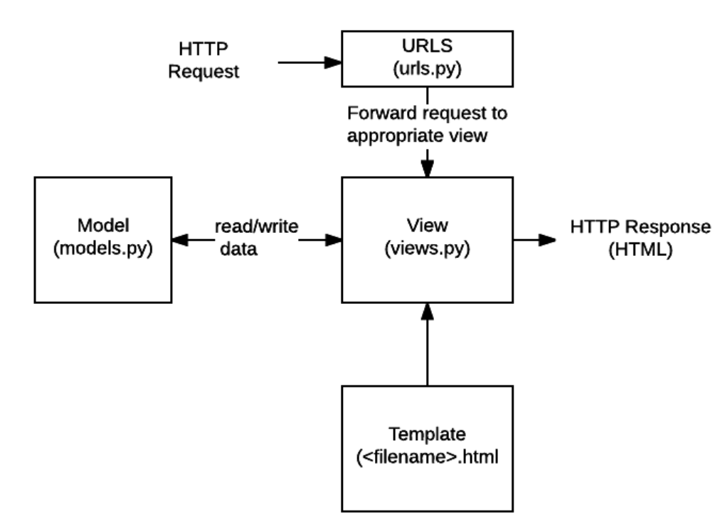
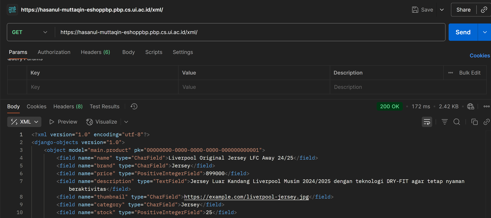
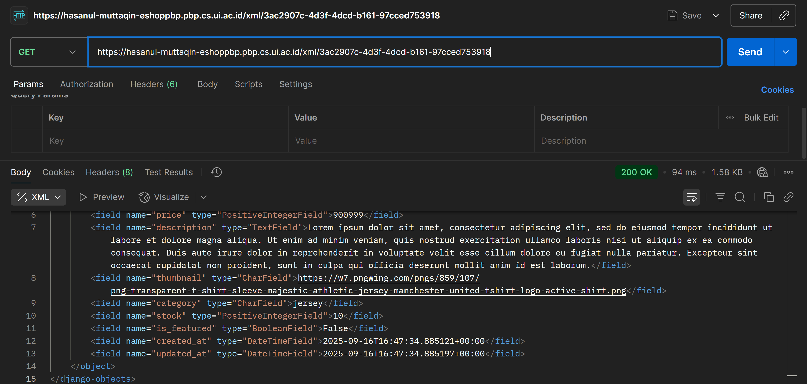
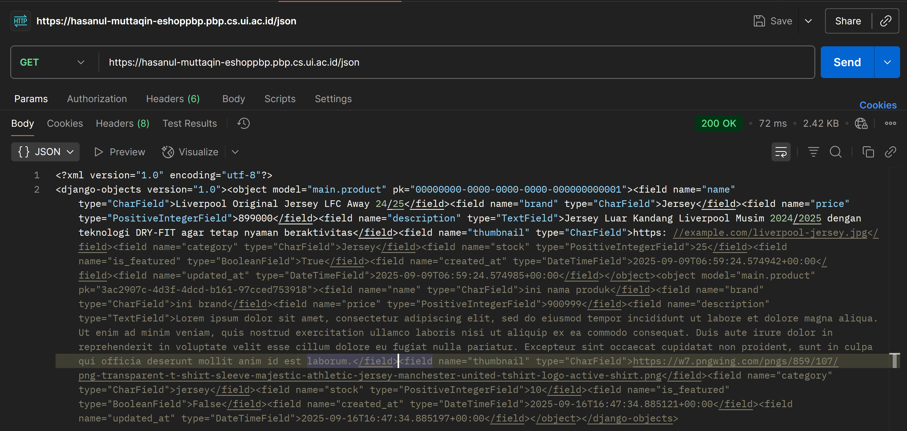
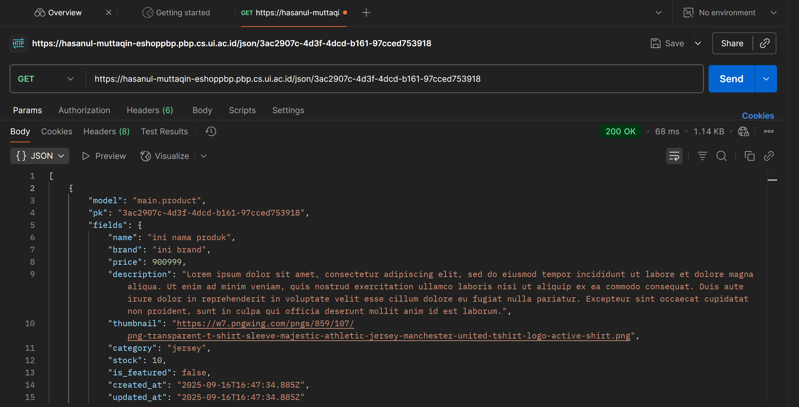

# Tugas 1

## 1. Jelaskan bagaimana cara kamu mengimplementasikan checklist di atas secara step-by-step

    - langkah 1: menjalankan perintah 'django-admin startproject eshop_pbp' di directory eshop-pbp via windows powershell. langkah ini dilakukan untuk menyiapkan struktur projek(manage.py dan juga folder eshop_pbp yang berisi settings.py, urls.py, dll)

    - langkah 2: membuat aplikasi main dengan menjalankan 'python manage.py startapp main' di directory eshop_pbp dan kemudian menambahkan main ke eshop_pbp/settings.py agar aplikasi dikenali

    - langkah 3: import admin dari django.contrib serta import path & include dari django.urls lalu include main.urls untuk mengarahkan root ke */main/urls.py

    - langkah 4: import models dari django.db ke */main/models.py dan buat class product(yg extend class model) dengan attribut yang sudah ditentukan di tugas serta magic function __str__ yang mengembalikan nama

    - langkah 5: import render dari django.shortcuts dan import class product ke */main/views.py yang sudah diberikan tadi lalu buat fungsi main_view() yang return model yang sudah di-render

    - langkah 6: import path ke */main/urls.py dan routing ke fungsi main_view()

    - langkah 7: membuat main.html di template yang nantinya akan jadi template untuk di-render di web

    - langkah 8: melakukan fungsi 'python manage.py makemigrations' dan 'python manage.py migrate' untuk migrasi model ke template

    - langkah 9: login ke PWS dari situs PBP dan mengisi environs lalu push ke server dengan 'git push pws master'

## 2. Buatlah bagan yang berisi request client ke web aplikasi berbasis Django beserta responnya dan jelaskan pada bagan tersebut kaitan antara urls.py, views.py, models.py, dan berkas html.

    (source: https://scele.cs.ui.ac.id/mod/forum/discuss.php?d=57480)
    alur kerja django dimulai ketika pengguna mengirimkan HTTP(Hypertext Transfer Protocol) request, seperti contohnya ketika mengetik url lewat browser atau menekan link dari hypertext. selanjutnya, request pengguna diterima oleh urls.py. fungsi program urls.py adalah melakukan pencocokkan antara url request pengguna dan path yang sudah didefinisikan. jika ada path yang cocok, maka views.py akan dipanggil. fungsi dari views.py adalah sebagai otak utama dari halaman web yang akan ditampilkan. views.py melakukan ini dengan mengambil elemen yg telah terdefinisi di models.py dan menyusunnya mengikuti arahan yang tersedia di templates/main.html. kemudian, django akan mengirimkan HTTP response dalam bentuk HTML(hypertext markup language) ke browser pengguna.

## 3. Jelaskan peran settings.py dalam proyek Django!
### settings.py adalah konfigurasi pusat proyek. Perannya meliputi:

         Menentukan daftar aplikasi terpasang (INSTALLED_APPS).

        - Konfigurasi database (DATABASES).

        - Konfigurasi template (TEMPLATES) dan lokasi template directory.

        - Middleware yang aktif (MIDDLEWARE).

        - STATIC_URL, STATIC_ROOT, dan konfigurasi static files.

        - SECRET_KEY, DEBUG, ALLOWED_HOSTS.

        - Pengaturan i18n/l10n (bahasa dan zona waktu).

        - Pengaturan autentikasi, email, logging, dan konfigurasi pihak ketiga.

## 4. Bagaimana cara kerja migrasi database di Django?
    makemigrations: django akan mebuat file migrasi yang merepresentasikan perubahan model sebagai operasi CreateModel, AddField, AlterField, dll.
    migrate: operasi migrasi file dilakukan dengan mengikuti database tertera sehingga tabel mengikuti informasi di models.py

## 5. Menurut Anda, dari semua framework yang ada, mengapa framework Django dijadikan permulaan pembelajaran pengembangan perangkat lunak?

    - Django memiliki banyak fitur built in

    - pola MTV yang sederhana sehingga lebih mudah dipahami

    - dokumentasi django yang mudah sehingga lebih mudah untuk pelajar dan pemula

    - keamanan dari banyak celah umum (CSRF, XSS, SQL injection)
    
    - komunitas dan ekosistem yang besar sehingga third party package dan tutorial

    - cocok untuk prototyping karena proses development yang cepat.

## 6. Apakah ada feedback untuk asisten dosen tutorial 1 yang telah kamu kerjakan sebelumnya?
    ga ada, slide sudah cukup jelas sehingga asistensi tidak terlalu diperlukan. tapi respons asdos cepat dalam menanggapi pertanyaan mahasiswa dan penjelasan yang diberikan mudah diikuti.

---

# Tugas 2

## 1. Mengapa kita memerlukan data delivery dalam pengimplementasian platform?
### Ada beberapa alasan mengapa data delivery diperlukan dalam implementasi platform
- komunikasi antar komponen: front-end butuh data dari back-end agar UI bisa ditampilkan
- skalabilitas: pemisahan front-end dan back-end memungkinkan development terpisah sehingga skalabilitas lebih mudah
- interoperabilitas: third party integration lebih mudah dengan format data JSON/XML
- Performa & pengalaman pengguna: data yang dikirim terstruktur memungkinkan caching, partial updates (AJAX), lazy loading, sehingga UX lebih responsif.
- Keamanan & kontrol akses: pengiriman terstruktur memudahkan otentikasi, otorisasi, rate-limiting, logging.
- Versi & backward compatibility: API versioning memudahkan migrasi tanpa memecah klien lama.
- Real-time & notifikasi: websocket/sse memungkinkan push data untuk fitur chat/live updates.

## 2.  Menurutmu, mana yang lebih baik antara XML dan JSON? Mengapa JSON lebih populer dibandingkan XML?
menurut saya lebih baik JSON, alasan JSON lebih popular ialah sebagai berikut:
- lebih ringan
- lebih mudah parsing ke JS karena native
- mendukung tipe data yang lebih banyak. seperti number, string, boolean, array, object, etc
- lebih bagus untuk data terstruktur karena variasi tipe data
- readability lebih bagus
- terhubung ke ekosistem java dan JS yang extensive(contoh, RESTful API)

## 3.  Jelaskan fungsi dari method is_valid() pada form Django dan mengapa kita membutuhkan method tersebut?
fungsi is_valid()
- Memicu proses full_clean di form
    - Validasi field-by-field (field validators, tipe data, required, min/max).
    - Panggil clean_<field>() custom jika ada.
    - Panggil clean() form-level untuk cross-field checks.
- Mengisi form.cleaned_data (versi data yang sudah dibersihkan/di-cast).
- Mengisi form.errors jika ada error.
- Mengembalikan True jika semua valid, False jika ada error.
##### fungsi: mencegah tipe data salah, menyediakan forms.error untuk user, membersihkan data untuk mencegah masalah keamanan seperti SQL inject, mencegah exception

## 4. Mengapa kita membutuhkan csrf_token saat membuat form di Django? Apa yang dapat terjadi jika kita tidak menambahkan csrf_token pada form Django? Bagaimana hal tersebut dapat dimanfaatkan oleh penyerang?

#### fungsi:
- Django meletakkan token unik per sesi (atau cookie) dan memverifikasinya pada request POST/PUT/DELETE yang diterima.
- Jika token tidak cocok/absent, middleware Django menolak request → mencegah tindakan atas nama pengguna tanpa izin.
#### risiko tidak memakai CSRF token
- inject laman jahat untuk menggunakan sesi pengguna lain
- korupsi data oleh sistem
- privilege escalation oleh attacker
- akses yang tidak diauthorisasi

## 5.  Jelaskan bagaimana cara kamu mengimplementasikan checklist di atas secara step-by-step (bukan hanya sekadar mengikuti tutorial).
1. keempat fungsi dibuat dengan menggunakan fungsi bawaan serialize dari Django.core. untuk show_xml() dan show_json() sebenarnya sangan mirip dengan grab semua object product .all() dan kemudian di serialize ke xml atau json, sedangkan untuk kedua fungsi ..._by_id() menggunakan variable baru products_id, yang nantinya akan digunakan untuk menjalankan fungsi .get() untuk mengambil data produk spesifik, kemudian di-wrap dalam list agar bisa di-serialize
2. dalam urls.py ditambahkan path /json dan /xml yang nantinya akan memanggil fungsi show_xml() dan show_json() untuk menampilkan semua product dalam template masing masing. dibuat juga path /xml/<str:products_id> dan /json/<str:products_id> yang akan memanggil masing-masing fungsi by id dengan menggunakan nilai yang diinput di url sebagai variable input products_id untuk fungsi
3. menambahkan button add di main/html yang route ke path /create-products dan juga jika tidak ada product akan muncul hyperlink 'add one' yang routing ke path yg sama. kemudian ada juga tombol 'Detail' dan on-click di card product yang routing ke /products/<id>
4. method create_products() di views.py memanggil forms.py lalu render create_products.html, yang memiliki input field untuk isi forms.py, dengan menekan button 'add product' user akan dikembalikan ke main.py yg mana akan lanjut cek validitas form sebelum menjalankan request method POST yang menambahkan form yang telah diisi sebagai produk sebelum mengembalikan user ke main
5. method show_products() di views.py akan mengambil id yang tertera dipanggil dalam URL request dan kemudian render show_products.html, mengisi field data dengan field data product yang uuid nya dipanggil. ada juga tombol 'back' yang memanggil url main untuk kembali ke main view

## 6. Apakah ada feedback untuk asdos di tutorial 2 yang sudah kalian kerjakan?
    gk ada, alhamdulillah dapet 100

## foto
show_xml()

show_xml_by_id()

show_json()

show_json_by_id()
